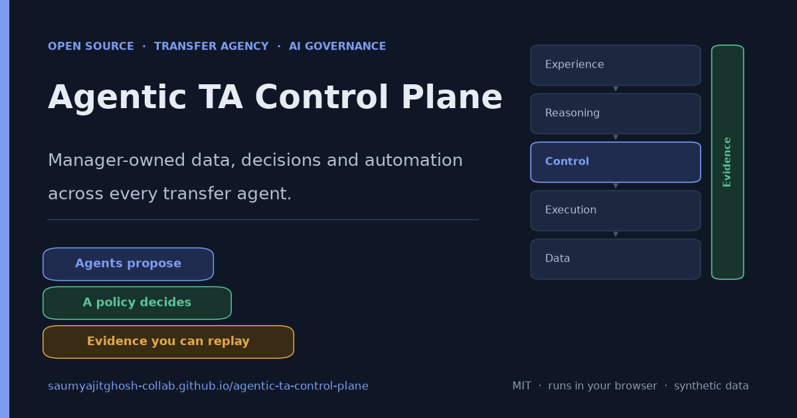
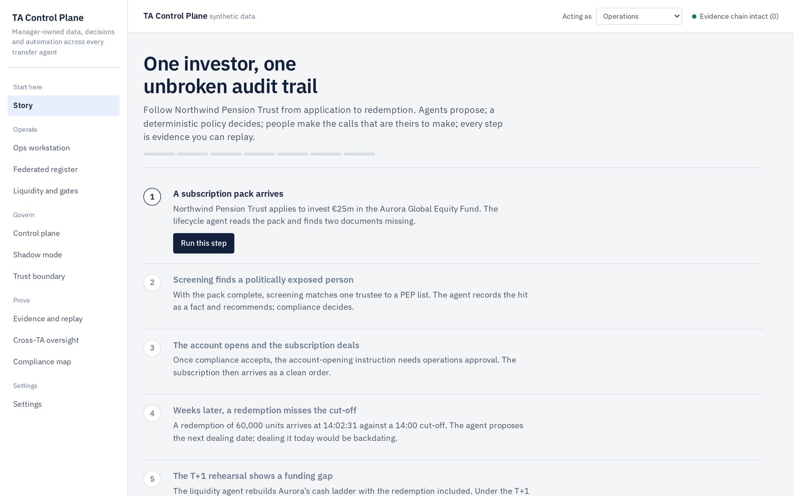
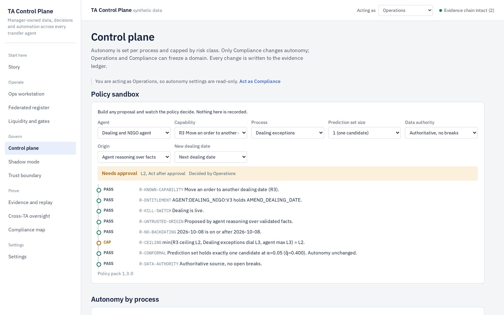
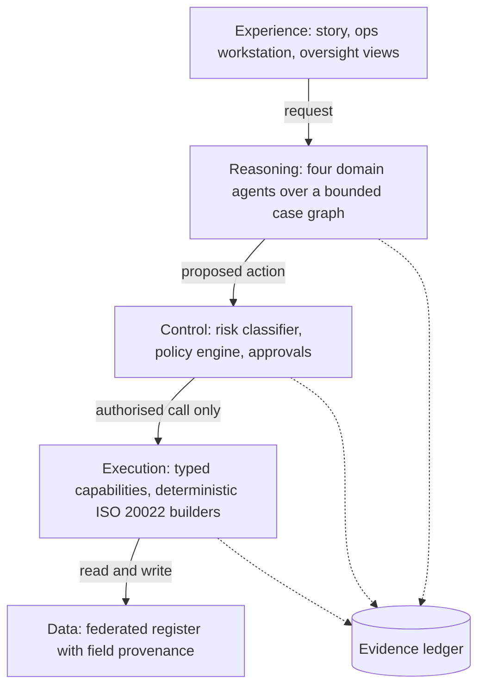

# Agentic TA Control Plane



[](https://github.com/saumyajitghosh-collab/agentic-ta-control-plane/actions/workflows/ci.yml)
[](LICENSE)
[](#run-it-locally)
[](package.json)

**Manager-owned data, decisions and automation across every transfer agent.**

A working, open-source demonstration of a control layer that sits *above* an asset manager's existing transfer agents. AI agents propose actions on transfer-agency cases; a deterministic policy decides what is allowed; people make the calls that are theirs to make; and every step is written to a hash-chained evidence ledger you can verify and replay.

> Build a TA control system that happens to contain AI, not an AI that happens to do TA.

**Live demo:** https://saumyajitghosh-collab.github.io/agentic-ta-control-plane/ — runs entirely in the browser on synthetic data. No sign-up, no backend, no API key needed.

---

## Why this exists

Transfer agency is moving from back-office utility to the source of investor experience and distribution intelligence. Providers are adding AI inside their own estates. What asset managers lack is a layer *they* control: one view of investor data across several TAs, and governed automation whose every decision they can evidence to a regulator.

This project shows that layer:

- **Federated, not a second register.** The TA's register stays the legal book of record. The platform keeps a normalised manager-side view with provenance on every field, and shows disagreements instead of silently picking a winner.
- **Agents propose; policy decides.** No model output is ever an authorisation.
- **Evidence for everything.** Proposals, verdicts, human decisions, executions and governance changes are envelopes in a tamper-evident chain, and any decision can be replayed.

## What you can do in the demo

| Screen | What it shows |
| --- | --- |
| **Story** | One investor's journey in seven connected steps: incomplete KYC pack → PEP match decided by Compliance → account opening approved by Ops → subscription → late redemption (backdating refused) → T+1 funding gap → provider oversight → auditor replay. |
| **Ops workstation** | The cross-TA queue. Run the agents, see each case's bounded *case graph*, the agent's proposal and candidates, the gate's rule-by-rule decision, evidence and messages. |
| **Federated register** | Holdings reported by TA registers, distributor files and a token ledger, with field-level provenance and open breaks. |
| **Liquidity and gates** | Cash ladder under today's T+2 vs the EU/UK T+1 cycle from 11 Oct 2027; quarterly pro-rata gate for a semi-liquid fund. |
| **Control plane** | Policy sandbox, autonomy dials per process, kill switches per domain, conformal α, agent identities and entitlements, policy rules. |
| **Shadow mode** | Agent recommendations vs human resolutions per process, with a deterministic promotion rule. |
| **Trust boundary** | Hostile documents (hidden instructions in a KYC pack, an email, an order narrative) and a 12-payload injection suite. Documents supply facts, never authority. |
| **Evidence and replay** | Verify the chain, replay every decision, simulate an after-the-fact edit and watch verification fail. |
| **Cross-TA oversight** | Normalised provider scorecards by complexity cohort, findings, downloadable oversight pack. |
| **Compliance map** | Where each expectation (Singapore agentic AI framework, EU AI Act, DORA, SEBI AI/ML reporting, prompt-injection risk) is met, plus a draft AI/ML application register. |
| **Pricing** | Free vs Operator, what each unlocks, and payment by UPI (India) or Razorpay (card + UPI, worldwide). |

Switch the **Acting as** role (Operations, Compliance, Fund board / ManCo, Distribution, Auditor) to see entitlements change what you can do.

## Screenshots

The Story follows one investor end to end; the Control plane is where policy, autonomy and entitlements are governed.

| Story: one investor, one unbroken audit trail | Control plane: policy sandbox and autonomy |
| --- | --- |
|  |  |

## Pricing

The demo is free to explore; running it is the **Operator** tier.

| | Free | Operator |
| --- | --- | --- |
| Story, Ops workstation, federated register, liquidity & gates | yes | yes |
| Trust boundary, evidence & replay, oversight, compliance map, policy sandbox | yes | yes |
| Run agents on the queue, decide real cases, governance changes | — | yes |
| Exports (policy pack, ledger, oversight pack, AI/ML register), bring-your-own-model | — | yes |

**₹2,999 / month** or **₹29,999 / year**. The first 30 days of Operator are free, tied to the device.

Pay by **UPI** in India, or **Razorpay** — one checkout that takes UPI and international cards, so it works outside India too. UPI alone will not serve overseas buyers.

The gate is client-side: it makes the free/paid line explicit and filters casual users, but it is not a security boundary. Payment cannot be verified without a server. See [docs/BILLING.md](docs/BILLING.md) for the Razorpay path that does it properly, and `server/razorpay-verify.js` for the reference backend.

The single owner/admin account signs in at [`login.html`](login.html). See [SECURITY.md](SECURITY.md) for exactly what that gate does and does not protect.

## The policy model

Every proposed action passes one policy function:

```
Permission = Policy(risk class, process, agent identity and autonomy,
                    data authority, calibrated confidence, origin, controls)
```

**Action risk classes** cap autonomy, whatever any dial says:

| Class | Covers | Ceiling |
| --- | --- | --- |
| R0 Read | Query, explain, summarise | L4 act within bounds |
| R1 Administrative | Request, route, draft, send status | L3 act and notify |
| R2 Record-changing, non-economic | Account metadata, account opening | L2 act after approval |
| R3 Economic or ownership | Orders, transfers, price, date or account changes | L2 act after approval |
| R4 Regulatory or fiduciary | KYC/AML determinations, gates, eligibility | L1 recommend; a person decides |

**Rules, in order** (see [`src/core/policy-pack.js`](src/core/policy-pack.js)): known capability → entitlement → kill switch → untrusted origin → no backdating → ceiling `min(risk ceiling, process dial, agent max)` → conformal escalation → data authority → maker-checker → R4 human.

**Confidence is evidence, never authorisation.** Agents return candidates with probabilities; a split-conformal prediction set is built from calibration data. Exactly one candidate in the set lets the case reach policy; zero or several escalate to a person. Confidence can lower autonomy, never raise it.

## Architecture



| Plane | Module |
| --- | --- |
| Policy pack (data) | `src/core/policy-pack.js` |
| Control: conformal sets, policy function, evidence ledger, replay | `src/core/control.js` |
| Reasoning: agent identities, entitlements, candidates | `src/core/agents.js` |
| Workflow runtime and capability executors | `src/core/engine.js` |
| Deterministic messages (setr.010/004/016, acmt.001, sese.001) | `src/core/messages.js` |
| Domain logic: validation, dealing dates, liquidity, gates, scorecards, shadow, trust boundary | `src/core/analytics.js` |
| Synthetic multi-TA world (seeded) | `src/core/data.js` |
| Seven-step story | `src/core/story.js` |
| UI | `src/app/app.js`, `assets/css/app.css` |

More detail: [docs/ARCHITECTURE.md](docs/ARCHITECTURE.md), [docs/CONTROLS.md](docs/CONTROLS.md), [docs/DEMO.md](docs/DEMO.md).

## Run it locally

No build step and no dependencies.

```bash
git clone https://github.com/saumyajitghosh-collab/agentic-ta-control-plane.git
cd agentic-ta-control-plane
python3 -m http.server 8080      # then open http://localhost:8080
```

Or build one self-contained file: `node scripts/bundle.js` → `dist/index.html`.

## Tests

```bash
node --test tests/core.test.js
```

Twelve tests, including 20,000 fuzzed proposals checking that: unentitled, untrusted-origin, frozen-domain and backdating proposals are always refused; autonomy never exceeds the risk ceiling, dial or agent maximum; R4 is always decided by a person; ambiguous confidence and open data breaks always escalate; and weaker confidence never yields more autonomy. Also covered: SHA-256 vectors, ISIN check digits, conformal quantiles, tamper detection, replay, message validation, the full story, the T+1 gap and the injection suite. CI runs them on every push.

## Deploy to GitHub Pages

The app is static and served from the repository root.

1. Push to `main` (or run `./scripts/push-to-github.sh`, which uses the GitHub CLI to create the public repo, push and enable Pages).
2. **Settings → Pages → Build and deployment → Deploy from a branch → `main` / `(root)`.**
3. The site appears at `https://<owner>.github.io/agentic-ta-control-plane/`.

## Optional: Claude as the reasoner

**Settings → Reasoner → Claude** and paste your Anthropic API key (held in the tab's memory only, sent only to `api.anthropic.com`). Claude then writes each proposal's rationale in the Ops workstation and may disagree with the top candidate. It cannot choose capabilities, set parameters or authorise anything; the calibrated candidate stands and the gate decides. The Story always runs deterministically.

## Limitations, stated plainly

- **Synthetic data.** Every name, ISIN, LEI and figure is generated from a fixed seed. Provider names are generic ("Provider A").
- **ISO 20022.** Messages follow ISO 20022 element naming for setr, acmt and sese, are built deterministically and pass structural and semantic checks, but are not validated against the official XSDs, which are not bundled. Versions are indicative.
- **Regulatory mappings** are illustrative design aids, not legal advice. Check current texts and timetables before relying on any of them.
- **Client-side only.** This edition demonstrates the control model in the browser. A production deployment would split propose and execute into separate services, hold write credentials only in the executor, and add identity, persistence and real provider adapters.
- **The paywall is client-side.** Free vs Operator is enforced in the browser and can be bypassed; payment is not verified without a server. See [docs/BILLING.md](docs/BILLING.md).

## Roadmap

- Server edition: FastAPI + Postgres, with the same policy pack and tests.
- Real provider adapters (file and ISO 20022) and XSD validation.
- Policy packs as signed, versioned artefacts with approval workflow.
- Multi-tenant identity (OIDC) and agent service identities.

## Licence

MIT © 2026 Saumyajit Ghosh. Not affiliated with any company mentioned in the related research.
